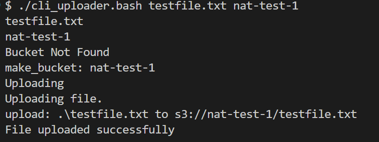

## About

## Pre Requisites

The AWS cli must be installed and configured. Please see [this](https://dev.to/binat/install-and-configure-aws-cli-on-windows-1obh) guide for additional information.

A terminal with a bash interpreter is required.

## Usage

Download the cli_uploader.bash file

Run it from a bash terminal with two arguments, the first being the filename, the second the name of the bucket. The bucket name must be unique.

`./cli_uploader.bash filename bucketname`

## Example

To upload a file testfile.txt to a bucket named nat-test-1, use the following command.

`./cli_uploader.bash testfile.txt nat-test-1`

This is the result.

## License

You can find the License for this project [here](LICENSE.md)

This project is licensed under the terms of the MIT license.